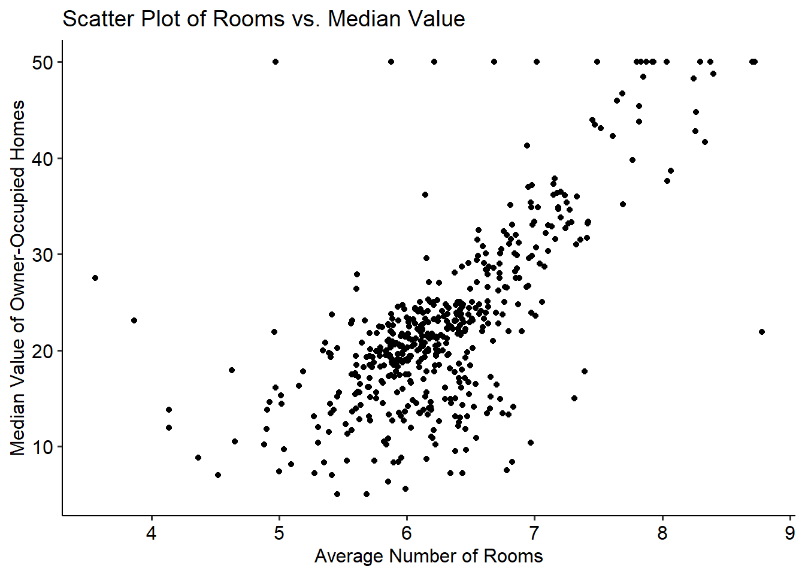
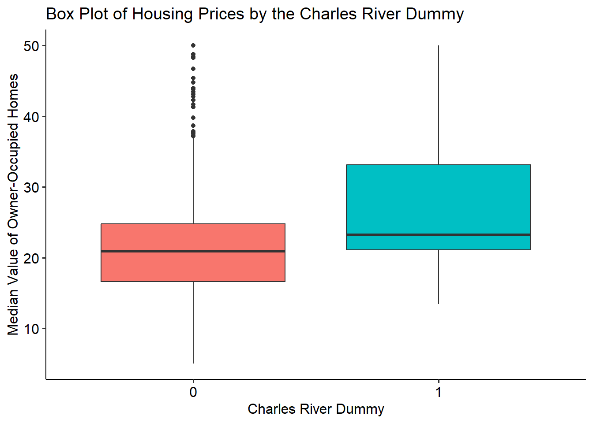

<!--more-->

```{r setup, include=FALSE}
knitr::opts_chunk$set(collapse = TRUE,fig.show = 'all')
```

**The Boston Housing Dataset**   

The Boston Housing dataset is a classic dataset widely used for regression analysis and predictive modeling tasks. It consists of various attributes of houses in Boston, such as crime rate, average number of rooms, and proximity to employment centers. In this article, we will leverage this dataset to create informative and visually appealing plots.   

**Loading and Exploring the Dataset**   

Fortunately, the dataset is already availed in R through a number of publicly available packages including the `MASS`, `ISLR`, `mlbench` packages among others. To access it, one would only need to install one of these packages, and load the dataset.

Below we load the data set from the `MASS` package, and we view its structure using the `str()` function of R.  

```{r}
library(MASS) #required library
data(Boston) #load data
str(Boston)#internal structure of the dataset
```

The Boston dataset as explored above consists of 506 observations across 14 variables. All its variables are either of `numeric` or `integer` data types.  
See [here](https://tipsydata.netlify.app/post/2023-05-23-introduction-to-data-types-in-r) for more details about data types in R.

To get a further overview of the data, we can use the summary function as below;

```{r}
summary(Boston) #descriptive statistics
```

**Creating Basic Plots in R**   

Let's start our data visualization journey by creating some basic plots. We will begin with a scatter plot of the average number of rooms (rm) versus the median value of owner-occupied homes (medv):

```{r scatterplot}
library(ggplot2)#build plots in layers
library(ggpubr) #publication ready graphics

# Scatter plot
ggplot(Boston, aes(x = rm, y = medv)) +
  geom_point() +
  labs(x = "Average Number of Rooms",
       y = "Median Value of Owner-Occupied Homes",
       title = "Scatter Plot of Rooms vs. Median Value") +
  theme_pubr()
```


{width=50%}
     

In the scatter plot above, we can observe the relationship between the average number of rooms and the median value of owner-occupied homes. This plot gives us an initial understanding of how these variables are related. For instance, there appears to be a positive trend, where an increase in the number of rooms in a dwelling unit appears to result to an increase in the median value of owner occupied homes. This relationship could be explored using other methods such as `OLS` regression.    

**Advanced Data Visualization Techniques**

To further explore the Boston Housing dataset, we can employ advanced data visualization techniques. For instance, we can create a box plot of the housing prices (medv) grouped by the neighborhood (neighborhood):

```{r boxplot}
#box plot
ggplot(Boston, aes(x = factor(chas), y = medv, fill= factor(chas))) +
  geom_boxplot() +
  labs(x = "Charles River Dummy",
       y = "Median Value of Owner-Occupied Homes",
       title = "Box Plot of Housing Prices by the Charles River Dummy") +
  theme(plot.title = element_text(hjust = 0.5))+
  theme_pubr(legend = "none")
```

     
{width=50%} 
A boxplot is a powerful way of visualizing numerical data grouped by nominal or ordinal features. In this example, note the conversion of the otherwise `integer` data type of the `chas` variable to factor variable, which enables us to visualize the boxplot above. From the boxplot, it is easy to conclude that those census tracts bound to the Charles river were observed to have higher median values of owner occupied homes than those that weren't during the 1970 census. The boxplot also ndicates the presence of outliers (points that go beyond Tukey's fences) for those tracts that weren't bound to the river.   

**Conclusion**  

In this blog post, we have explored the Boston Housing dataset and demonstrated the power of data visualization in R. By creating visual representations of the data, we can easily identify patterns, relationships, and outliers.

Data visualization is an essential skill for any data scientist or analyst. It enables us to effectively communicate insights and make data-driven decisions.  

Leave a comment below and stay tuned for more exciting topics in our data science journey!