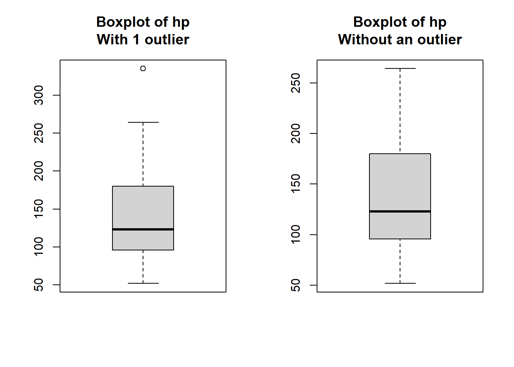
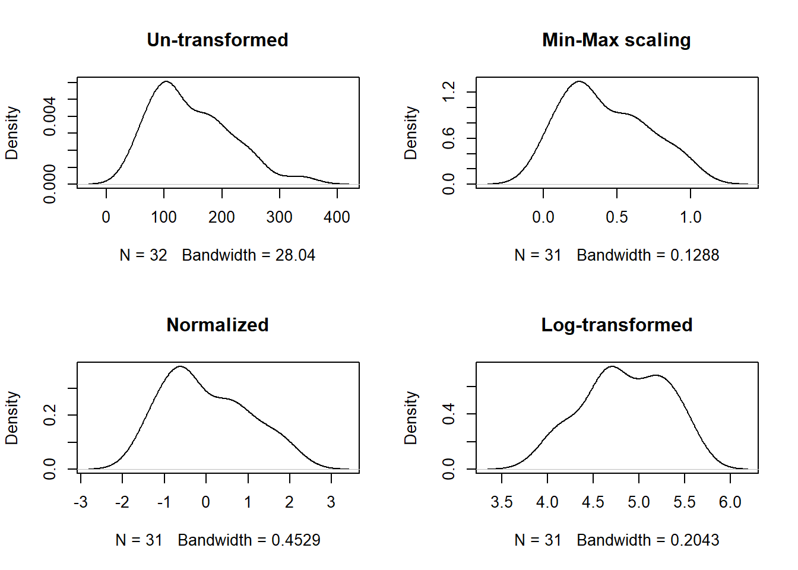

<!--more-->

```{r setup, include=FALSE}
knitr::opts_chunk$set(collapse = TRUE, fig.show = 'all')
```

## Introduction

Data cleaning and pre-processing are vital steps in any data analysis project. They involve identifying and resolving issues in the dataset to ensure accurate and reliable results. In this article, we will explore various techniques and tools in R for cleaning and pre-processing data using the popular "mtcars" dataset.

**1. Handling Missing Data**

Missing data can significantly impact the analysis and modeling process. Let's use the "mtcars" dataset to demonstrate techniques for handling missing values. Here's an example code snippet:

```{r}
#clear workspace every rerun
rm(list=ls())
data("mtcars")
#descriptive statistics
summary(mtcars)
```
     

```{r}
#check for missing values
sum(is.na(mtcars))
clean_data <- na.omit(mtcars)
```

Fortunately to us, the `mtcars` dataset which is pre-installed with R does not have missing values. In the real world, missing data is the norm rather than the exception.    

If the dataset had missing values and we wanted to remove all the observations (rows of the dataset) that had missing values in any of the columns, we would simply pass a powerful inbuilt function of R called `na.omit()` as above and it would get the job done!


**2. Dealing with Outliers**   

Outliers can distort statistical measures and affect the overall analysis. We'll utilize the "mtcars" dataset to showcase methods for detecting and handling outliers in R. Here's an example code snippet:   

```{r boxplot}
par(mfrow=c(1,2))
#visualizing outliers using boxplots
boxplot(mtcars$hp,main="Boxplot of hp\nWith 1 outlier")
#removing outliers using Tukey's fences (IQR)
q1 <- quantile(clean_data$hp)[2]
q3 <- quantile(clean_data$hp)[4]
iqr <- q3 - q1
upper_limit <- q3 + 1.5 * iqr
clean_data <- subset(clean_data, hp <= upper_limit)
boxplot(clean_data$hp, main="Boxplot of hp\nWithout an outlier")
```


**3. Data Normalization and Scaling**    

Normalization and scaling techniques help standardize the range and distribution of variables. Using the "mtcars" dataset, we'll demonstrate methods like min-max scaling, z-score normalization, and logarithmic transformations, and visualize their differences on the `hp` variable's distribution;

```{r scaling}
#perform min-max scaling
scaled_data <- data.frame(apply(clean_data, 2, 
                     function(x) (x - min(x))/(max(x) - min(x))))
#perform z-score normalization
normalized_data <- data.frame(scale(clean_data))
#apply logarithmic transformation
transformed_data <- log(clean_data)
par(mfrow=c(2,2))
plot(density(mtcars$hp), "Un-transformed")
plot(density(scaled_data$hp),"Min-Max scaling")
plot(density(normalized_data$hp), main = "Normalized")
plot(density(transformed_data$hp),main = "Log-transformed")
```
      


   
The choice of transformation method depends on various factors, such as the type of data, its distribution, and the objectives of your study or project. In the case of our analysis, let's consider the hp variable. If our study requires the features or variables to follow a normal distribution, based on the results above, it appears that applying a natural log transformation to the hp variable provides a better approximation of normality compared to the other methods. Keep in mind that there are alternative approaches to assess normality, which we will explore in more detail later on.    


**4. Handling Categorical Variables**    

Categorical variables require special treatment during pre-processing. We'll use the "mtcars" dataset to illustrate methods such as label encoding, one-hot encoding, and frequency encoding.      

```{r label encoding}
#perform label encoding
table(mtcars$cyl)
mtcars$cyl <- as.factor(mtcars$cyl)
class(mtcars$cyl)
```
     
Among the three methods applied, label encoding is the simplest to understand and the fastest to implement depending on your approach. One only needs to investigate the distribution of the unique classes for each class and convert to factor data type using the `as.factor()` function of R.   

    
```{r frequency-and-onehotencoding, warning=FALSE, message=FALSE}
#perform frequency encoding
library(dplyr)
library(knitr)
mtcars |>
  group_by(cyl) |>
  mutate(freq_enc = n()) |>
  head()|>
  kable()
#perform one-hot encoding
onehot_data <- model.matrix(~., data = clean_data)
```
      
The explanation for this part is a bit technical but you should have nothing to worry about. If these terms are new to you or sound too harsh, you can simply ignore them for the moment. I am sure as you progress with your learning, you shall grasp them.

When you have categorical variables that do not have a natural order or hierarchy, the One-hot encoding method creates binary columns for each category, representing the presence or absence of that category in the data.

Frequency encoding, is also known as count encoding. It is a technique used to encode categorical variables by replacing each category with its frequency or count within the dataset. In the code example about frequency encoding, we have grouped the `mtcars` dataset by the `cyl` variable (represents the number of cylinders in a vehicle) and counted the number of occurrences of each class, and assigned the values to a new variable/feature named `freq_enc`.  

One-hot encoding is used to convert categorical variables into a binary representation that can be easily understood by machine learning algorithms. It is typically applied when dealing with categorical data that does not have an inherent ordinal relationship among its categories. This method allows one to expand the feature space (dimensions) without introducing ordinality or making assumptions about the relationship between categories. In R, this method can be implemented using the `model.matrix()` function of the `stats` package in base R.

To compare the two methods, instead of creating a separate binary column for each category like in one-hot encoding, frequency encoding directly replaces each category with its occurrence count. This helps to reduce the dimensionality of the data while preserving valuable information about the distribution of categories. Moreover frequency encoding allows the data modeling algorithms to capture the general patterns by encoding them based on their occurrence frequencies, mitigating sparsity in the process and preventing overfitting on the rare classes.

**5.Feature Engineering**    

Feature engineering involves creating new variables or transforming existing ones to improve model performance. We'll leverage the "mtcars" dataset to showcase techniques such as creating interaction terms, polynomial features, and dimensionality reduction.

```{r feat-eng, warning=FALSE, message=FALSE, out.width="100%"}
png("index_files/figure-html/feat-eng.png")
#create interaction terms
mtcars$interaction <- mtcars$hp * mtcars$wt
#create polynomial features
mtcars$wt_sq <- mtcars$wt^2
#perform dimensionality reduction using principal component analysis (PCA)
library(caret)
library(factoextra)
mtcars$cyl <- as.numeric(mtcars$cyl)
mtcars|>
  prcomp() |> 
  fviz_pca_ind()
dev.off()
mtcars|> 
  preProcess(method = "pca") |> 
  predict(mtcars)|>
  head(5)|>
  kable()
```


**Conclusion**     

Data cleaning and preprocessing are crucial steps in data analysis. By utilizing the power of R and leveraging the "mtcars" dataset, we have explored techniques for handling missing data, dealing with outliers, normalizing variables, handling categorical data, and performing feature engineering. These techniques enable us to work with clean, reliable, and actionable data for analysis and modeling tasks.

Start cleaning and preprocessing your data in R today and unlock the true potential of your analyses!

Stay tuned for more informative articles on data science and R programming. If you have any questions or suggestions, feel free to leave a comment below.

Happy coding! 🚀

