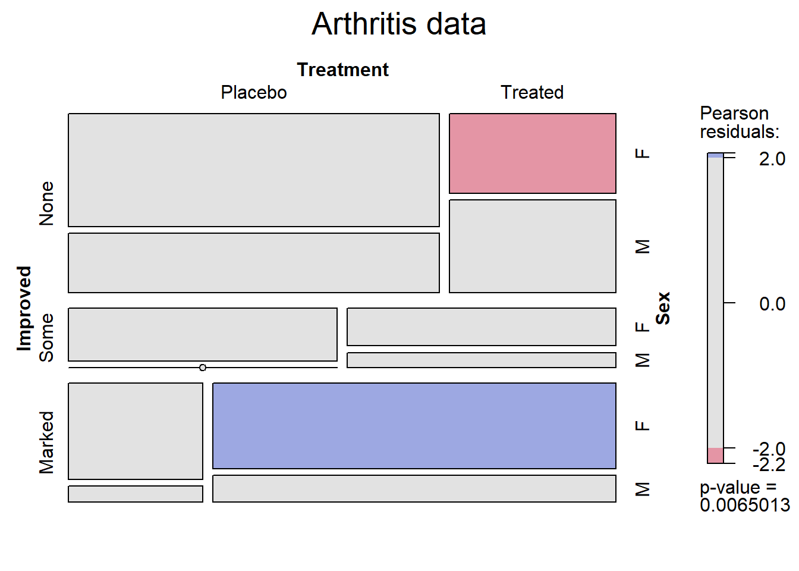
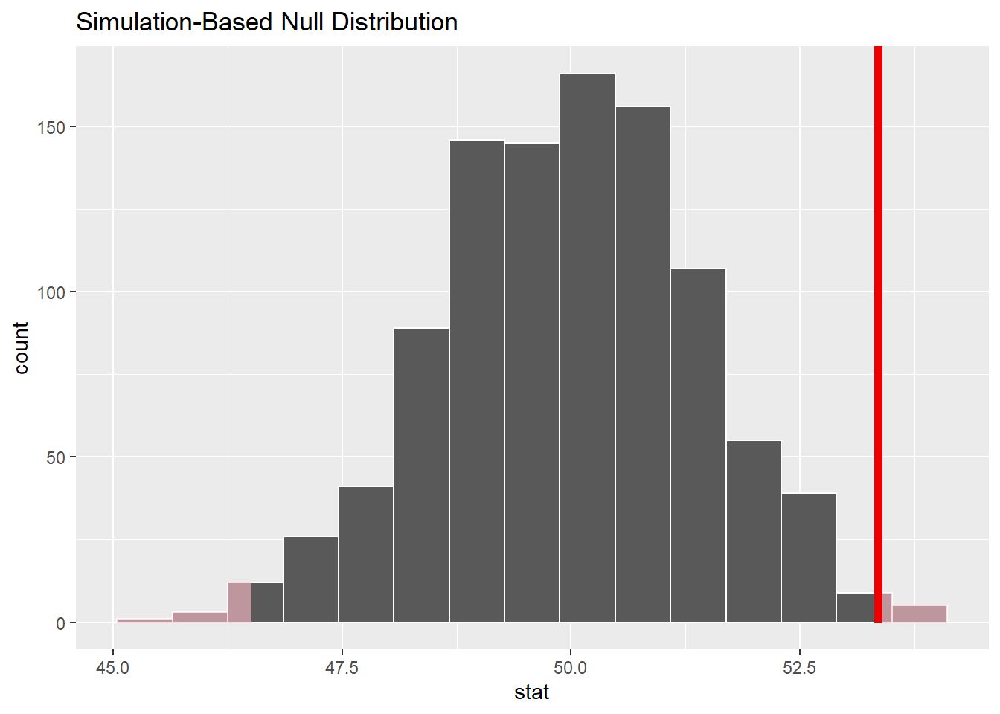
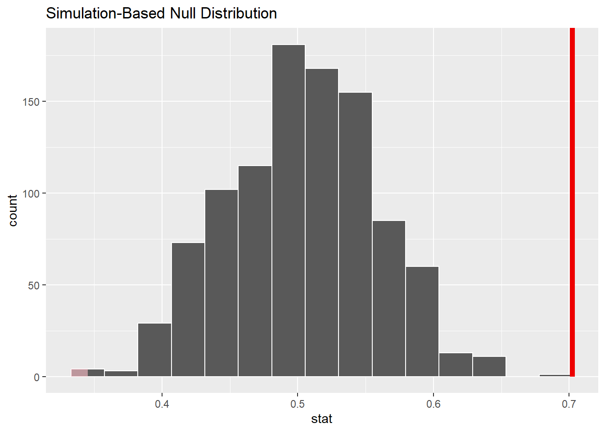
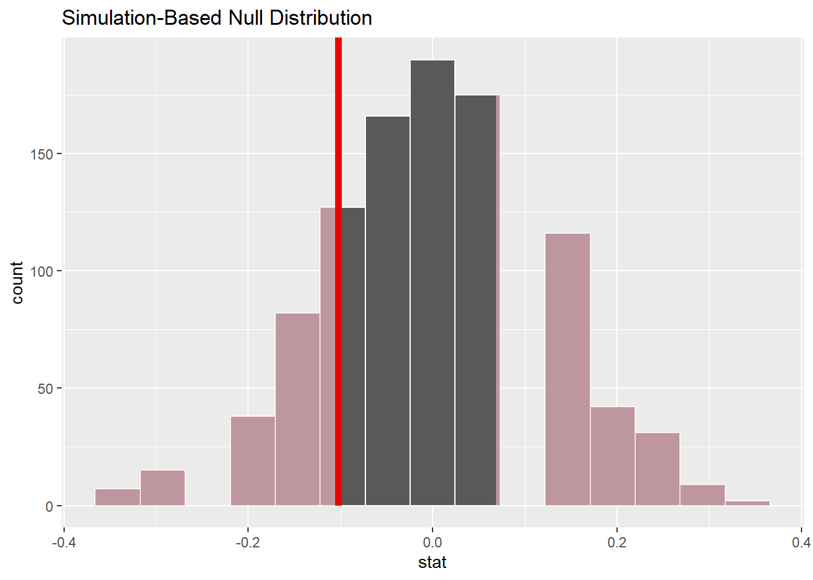
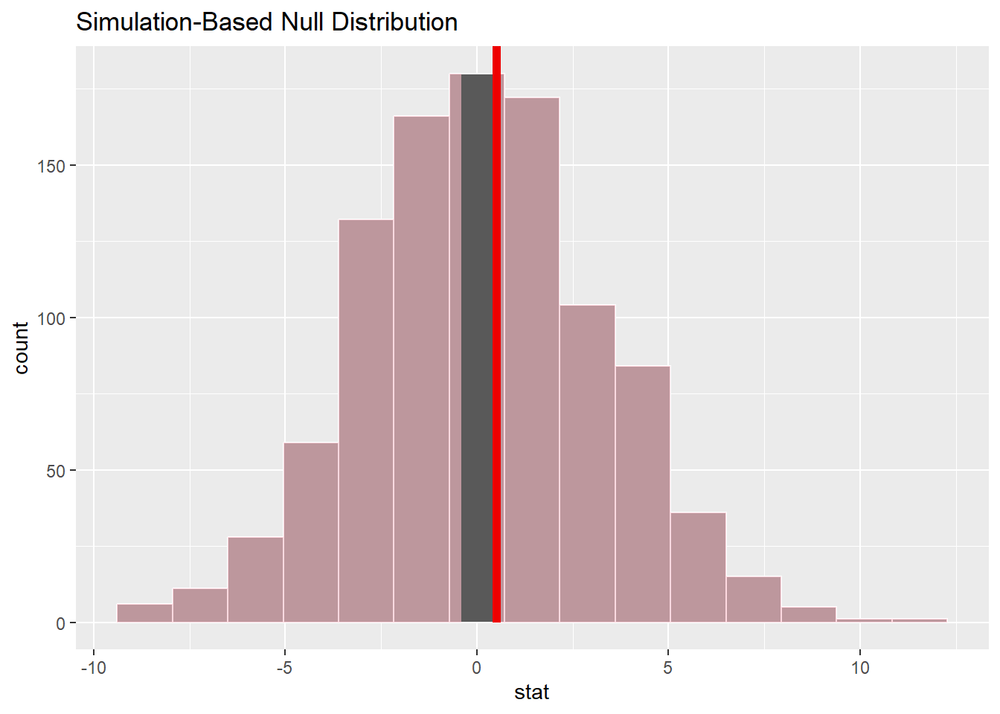

<!--more-->

## Introduction to Inferential Statistics using R.

Inferential statistics is a branch of statistics that allows us to draw conclusions about a population based on data collected from a sample. It provides valuable insights into various aspects of data analysis. In this blog post, we will explore the key concepts of inferential statistics and discuss some common techniques used for making informative inferences.

Before conducting inferential statistical analysis, it is important to consider the assumptions specific to each test.

In R, we can leverage among many other options, the `infer` package, to conduct inferential tests. This package provides functions that facilitate inferential statistics.

Interpreting the results of inferential tests involves several factors. Firstly, the `p-value` indicates the likelihood of obtaining the results by chance. A low `p-value` typically `\((p < 0.05)\)` suggests statistically significant test results.

Secondly, we consider the effect size, which quantifies the strength of the relationship between variables. A large effect size indicates a strong relationship, while a small effect size suggests a weak relationship.

Lastly, we examine the confidence interval, a range likely to contain the true parameter value. A narrow confidence interval signifies a more precise estimate, while a wide interval reflects lower confidence.

The examples below demonstrate hypothesis testing, and regression analysis in R. Each example highlights the steps, results, and their implications.

## Dataset.

The dataset to be used in all the sections is the data frame `Arthritis` installed and loaded with the `vcd` package. The dataset is described as; “Data from Koch & Edwards (1988) from a double-blind clinical trial investigating a new treatment for rheumatoid arthritis.”.

The descriptive statistics and a visualization of the data are shown below;

``` r
#clear workspace
rm(list=ls())
library(dplyr)
library(infer)
##load vcd package
library(vcd)
##load Arthritis dataset (data frame)
data(Arthritis)
#create a cross table for visualization
arthritis_table <- xtabs(~Improved + Treatment + Sex, Arthritis)
ftable(arthritis_table)
##                    Sex Female Male
## Improved Treatment                
## None     Placebo           19   10
##          Treated            6    7
## Some     Placebo            7    0
##          Treated            5    2
## Marked   Placebo            6    1
##          Treated           16    5
```

From the cross table of the arthritis dataset, we can derive several inferences. The table shows the distribution of individuals by their Sex (Female and Male) and the improvement in their condition (None, Some, or Marked) based on the treatment they received (Treated or Placebo).

The majority of individuals in the dataset are Female, as indicated by the higher counts in the “Female” column compared to the “Male” column. Among the individuals who received no treatment (None), there were more Females (19) than males (10).

For the individuals who received the placebo treatment, there were more Females than males in all three categories of improvement (None, Some, and Marked). However, the difference is particularly notable in the “Some” category, where there were 7 Females and no males.

In the “Treated” group, the counts vary across the different levels of improvement. For example, in the “None” category, there were 6 Females and 7 males. In the “Some” category, there were 5 Females and 2 males. In the “Marked” category, there were 16 Females and 5 males.

``` r
#visualize arthritis data using a mosaic plot
mosaic(arthritis_table, shade = TRUE, legend = TRUE, 
       labeling_args = list(set_varnames = c(Sex = "Sex", 
                                             Improved = "Improved", 
                                             Treatment = "Treatment")),
       set_labels = list(Improved = c("None", "Some", "Marked"),
                         Class = c("Placebo", "Treated"),
                         Sex = c("F", "M")),
       main = "Arthritis data")
```

}}index_files/figure-html/mosaicplot-1.png" width="672" />



## Hypothesis testing.

This inference method compares groups to determine if they are statistically different.

### Statistical inference on the `Age` numerical variable (Mean).

Computing the observed `mean` statistic of the `Age` variable;

``` r
obs_age_mean <- Arthritis |>
  observe(response = Age, stat = "mean")
obs_age_mean
## Response: Age (numeric)
## # A tibble: 1 × 1
##    stat
##   <dbl>
## 1  53.4
```

Then, generating the null distribution and Visualizing the observed statistic alongside the null distribution;

``` r
set.seed(123) #for reproducible results
null_dist <- Arthritis |>
  specify(response = Age) |>
  hypothesize(null = "point", mu = 50) |>
  generate(reps = 1000) |>
  calculate(stat = "mean")
visualize(null_dist) +
  shade_p_value(obs_stat = obs_age_mean, direction = "two-sided")
```

}}index_files/figure-html/agemeannull-1.png" width="672" />



Calculating the p-value from the null distribution and observed statistic;

``` r
null_dist |>
  get_p_value(obs_stat = obs_age_mean, direction = "two-sided")
## # A tibble: 1 × 1
##   p_value
##     <dbl>
## 1   0.014
```

### Statistical inference on the `Sex` categorical variable (Proportion).

Computing the observed statistic, using the `observe()` wrapper;

``` r
prop_g <- Arthritis |>
  observe(response = Sex, 
          success = "Female", stat = "prop")
prop_g
## Response: Sex (factor)
## # A tibble: 1 × 1
##    stat
##   <dbl>
## 1 0.702
```

Then, generating the null distribution and Visualizing the observed statistic alongside the null distribution;

``` r
set.seed(123)#for reproducibility
null_dist <- Arthritis |>
  specify(response = Sex, success = "Female") |>
  hypothesize(null = "point", p = .5) |>
  generate(reps = 1000) |>
  calculate(stat = "prop")
visualize(null_dist) +
  shade_p_value(obs_stat = prop_g, direction = "two-sided")
```

}}index_files/figure-html/sexpropnull-1.png" width="672" />



Calculating the p-value from the null distribution and observed statistic;

``` r
null_dist |>
  get_p_value(obs_stat = prop_g, direction = "two-sided")
## # A tibble: 1 × 1
##   p_value
##     <dbl>
## 1       0
```

### Sex and Treatment categorical variables (difference in proportions test).

Here, we test difference in proportions between the `Female` and `Male` genders in the `Treatment` variable.

Computing the observed statistic using the `observe()` wrapper;

``` r
diff_in_g_props <- Arthritis |> 
  observe(Treatment ~ Sex, success = "Treated", 
          stat = "diff in props", order = c("Female", "Male"))
diff_in_g_props
## Response: Treatment (factor)
## Explanatory: Sex (factor)
## # A tibble: 1 × 1
##     stat
##    <dbl>
## 1 -0.102
```

Then, generating the null distribution and Visualizing the observed statistic alongside the null distribution;

``` r
set.seed(123)
null_dist <- Arthritis |>
  specify(Treatment ~ Sex, success = "Treated") |>
  hypothesize(null = "independence") |> 
  generate(reps = 1000) |> 
  calculate(stat = "diff in props", order = c("Female", "Male"))
visualize(null_dist) +
  shade_p_value(obs_stat = diff_in_g_props, direction = "two-sided")
```

}}index_files/figure-html/treatmentsexnull-1.png" width="672" />



Calculating the p-value from the null distribution and observed statistic;

``` r
null_dist |>
  get_p_value(obs_stat = diff_in_g_props, direction = "two-sided")
## # A tibble: 1 × 1
##   p_value
##     <dbl>
## 1   0.538
```

### Statistical inference on Age and Sex (difference in grouped means).

Calculating the observed statistic using the `observe()` wrapper;

``` r
diff_in_age_sex_mean <- Arthritis |> 
  observe(Age ~ Sex,
          stat = "diff in means", order = c("Female", "Male"))
```

Then, generating the null distribution and Visualizing the observed statistic alongside the null distribution;

``` r
null_dist <- Arthritis |>
  specify(Age ~ Sex) |>
  hypothesize(null = "independence") |>
  generate(reps = 1000, type = "permute") |>
  calculate(stat = "diff in means", order = c("Female", "Male"))
visualize(null_dist) +
  shade_p_value(obs_stat = diff_in_age_sex_mean, direction = "two-sided")
```

}}index_files/figure-html/agesexnull-1.png" width="672" />



Calculating the p-value from the null distribution and observed statistic;

``` r
null_dist |>
  get_p_value(obs_stat = diff_in_age_sex_mean, direction = "two-sided")
## # A tibble: 1 × 1
##   p_value
##     <dbl>
## 1     0.9
```

## Regression analysis.

This method is used when we need to predict the value of one variable based on another.

### OLS model on the `Improved` variable.

``` r
library(ExPanDaR)
library(htmltools)
fixed_model <- prepare_regression_table(Arthritis, dvs = "Improved", idvs = c("Sex", "Treatment", "Age"), models = "ols")
HTML(fixed_model$table)
```

 <table style="text-align:center"><tr><td colspan="2" style="border-bottom: 1px solid black"></td></tr><tr><td style="text-align:left"></td><td><em>Dependent variable:</em></td></tr> <tr><td></td><td colspan="1" style="border-bottom: 1px solid black"></td></tr> <tr><td style="text-align:left"></td><td>Improved</td></tr> <tr><td colspan="2" style="border-bottom: 1px solid black"></td></tr><tr><td style="text-align:left">SexMale</td><td>-0.453</td></tr> <tr><td style="text-align:left"></td><td></td></tr> <tr><td style="text-align:left"></td><td></td></tr> <tr><td style="text-align:left">TreatmentTreated</td><td>0.707</td></tr> <tr><td style="text-align:left"></td><td></td></tr> <tr><td style="text-align:left"></td><td></td></tr> <tr><td style="text-align:left">Age</td><td>0.016</td></tr> <tr><td style="text-align:left"></td><td></td></tr> <tr><td style="text-align:left"></td><td></td></tr> <tr><td style="text-align:left">Constant</td><td>0.770</td></tr> <tr><td style="text-align:left"></td><td></td></tr> <tr><td style="text-align:left"></td><td></td></tr> <tr><td colspan="2" style="border-bottom: 1px solid black"></td></tr><tr><td style="text-align:left">Estimator</td><td>ols</td></tr> <tr><td style="text-align:left">Fixed effects</td><td>None</td></tr> <tr><td style="text-align:left">Std. errors clustered</td><td>No</td></tr> <tr><td style="text-align:left">Observations</td><td>84</td></tr> <tr><td style="text-align:left">R<sup>2</sup></td><td>NA</td></tr> <tr><td style="text-align:left">Adjusted R<sup>2</sup></td><td>NA</td></tr> <tr><td colspan="2" style="border-bottom: 1px solid black"></td></tr><tr><td style="text-align:left"><em>Note:</em></td><td style="text-align:right"><sup>*</sup>p<0.1; <sup>**</sup>p<0.05; <sup>***</sup>p<0.01</td></tr> </table>

## Conclusion.

Inferential statistics is a powerful tool for drawing conclusions about populations based on samples. It requires careful consideration of assumptions, accurate test implementation, and correct result interpretation.

Watch out for my next posts about correlation analysis, confidence intervals and regression analysis!
