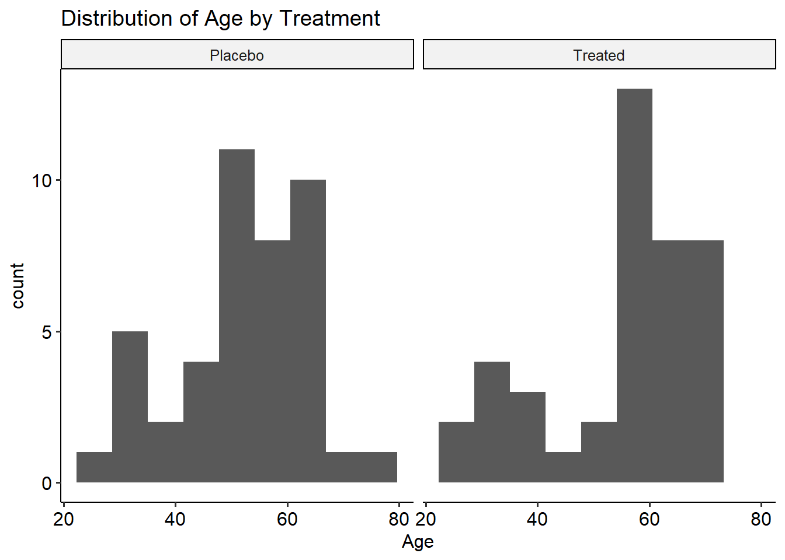

<!--more-->

## Introduction to inferences using Confidence Intervals in R.

Welcome back to our series on inferential statistics! 

In today's post, we will delve into the fascinating world of confidence intervals, a vital concept for making reliable estimations. 
Building upon our previous discussions on hypothesis testing and regression analysis, we will continue to use the Arthritis dataset and leverage the power of R and its packages, especially with the `infer` package for this post.   

## Understanding Confidence Intervals.   

Confidence intervals provide a range of values within which we believe the true population parameter lies. They offer valuable insights into the precision and uncertainty associated with our estimations.

## Dataset.    

To ensure continuity, we will once again work with the Arthritis dataset from the `vcd` package. This dataset originated from a double-blind clinical trial investigating a new treatment for rheumatoid arthritis. 

Let's dive into the data and explore confidence intervals!


```r
#load necessary packages
library(dplyr)
library(infer)
library(ggplot2)
library(ggpubr)
library(vcd)
#load the Arthritis dataset
data(Arthritis)
#display descriptive statistics of the dataset
summary(Arthritis)
##        ID          Treatment      Sex          Age          Improved 
##  Min.   : 1.00   Placebo:43   Female:59   Min.   :23.00   None  :42  
##  1st Qu.:21.75   Treated:41   Male  :25   1st Qu.:46.00   Some  :14  
##  Median :42.50                            Median :57.00   Marked:28  
##  Mean   :42.50                            Mean   :53.36              
##  3rd Qu.:63.25                            3rd Qu.:63.00              
##  Max.   :84.00                            Max.   :74.00
```

### Confidence Interval for a Numerical Variable (Age).   

To estimate the population mean age with a certain level of confidence, we can construct a confidence interval. First,we need to visualize the distribution of the Age variable first;  


```r
Arthritis |>
  ggplot(aes(x = Age)) +
  geom_histogram(bins = 9) +
  facet_wrap(~Treatment) +
  labs(title = "Distribution of Age by Treatment")+
  theme_pubr()
```

}}index_files/figure-html/agehistogram-1.png" width="672" />
    
    
       
    


   
Previously in the [Hypothesis testing module of inferential statistics](https://tipsydata.netlify.app/post/2023-05-28-statistical-data-analysis-in-r), we computed point estimates including the observed sample `mean` statistic of the `Age` variable. However, the observed mean age statistic of the sample cannot be relied upon as the true population mean. It is for this reason that we apply bootstrapping to compute a confidence interval, within which we expect to find the populations statistic at a given level of significance.


```r
age_ci <- Arthritis |>
  specify(response = Age) |>
  generate(reps = 1000, type = 'bootstrap') |>
  calculate(stat = "mean") |>
  get_confidence_interval(level = 0.95, type = "percentile")
age_ci
## # A tibble: 1 × 2
##   lower_ci upper_ci
##      <dbl>    <dbl>
## 1     50.7     56.1
```
      
From the results of the confidence interval computation, we may use the confidence interval (C.I.) values indicate to make a conclusion about the mean age of the subjects in The Arthritis data. In this case, we are not sure about the true mean of the subjects of the Arthritis study, but we know that the mean age of the subjects in the Arthritis data is between 50.62(2 d.p.) and 55.93(2 d.p.) at a 0.05 level of significance.


### Confidence Interval for a Categorical Variable `Sex` (Proportion).    

For categorical variables, we can estimate the population proportion within a specified confidence interval. In the example below, we compute a confidence interval for the proportion of the "Female" class in the `Sex` variable.   


```r
Arthritis |>
  ggplot(aes(Sex, fill = Sex)) + 
  geom_bar() +
  labs(title = "The Sexes in the Arthritis data")+
  theme_pubr()
```

}}index_files/figure-html/sex-1.png" width="672" />
    
     
      

It is evident from the graphic above that there are more females than males among the subjects of the Arthritis data. Depending on the design of the study, this could be,  perhaps, implying that there are more females suffering from Rheumatoid Arthritis than there are males. If this were the case, we would then be interested in making estimations about the population, and this is where the confidence intervals check in.


```r
sex_prop_ci <- Arthritis |>
  specify(response = Sex, success = "Female") |>
  generate(reps = 1000, type = 'bootstrap') |>
  calculate(stat = "prop") |>
  get_confidence_interval(level = 0.95, type = "percentile")
sex_prop_ci 
## # A tibble: 1 × 2
##   lower_ci upper_ci
##      <dbl>    <dbl>
## 1    0.607    0.798
```
     
The confidence interval of [0.6071, 0.7976] (4 d.p). implies that while we are not sure of the true proportion of female subjects suffering from Rheumatoid Arthritis in the Arthritis dataset, we know that the proportion of females is between 0.6071 and 07976 (4. d.p.) at a 0.05 level of significance.    


### Confidence Interval for the Difference between Two Groups (Treatment)  

We can estimate the difference in population proportions between two groups using confidence intervals. In the following example, we shall compute the confidence interval for the difference in proportions between females and males subject based on the treatment groups.  


```r
Arthritis |>
  ggplot(aes(Sex, fill =Treatment)) + 
  geom_bar() +
  labs(title = "Treatment vs. Sex")+
  theme_pubr()
```

}}index_files/figure-html/treatmentsex-1.png" width="672" />


    

      


```r
Arthritis |>
  specify(formula= Treatment~Sex, success = "Treated") |>
  generate(reps = 1000, type = 'bootstrap') |>
  calculate(stat = "diff in props", order = c("Female","Male")) |>
  get_confidence_interval(level = 0.95, type = "percentile")
## # A tibble: 1 × 2
##   lower_ci upper_ci
##      <dbl>    <dbl>
## 1   -0.338    0.127
```
      
To interpret the computed confidence interval of [-0.328, 0.1408] (4 d.p.), we could say that while we are not sure of the true difference in proportions between the females and males who received treatment, we know that the proportion of males who underwent treatment among the males was greater than the proportion of females among the female group who underwent treatment.


## Conclusion.    

Confidence intervals are a powerful tool for estimating population parameters and understanding the precision of our estimations. In this blog post, we explored constructing confidence intervals for numerical and categorical variables, as well as for comparing two groups. By leveraging the Arthritis dataset and R's inferential statistics packages, we gained valuable insights into the world of confidence intervals.

Stay tuned for our next post, where we will delve into the fascinating realm of correlation analysis and uncover relationships between variables!
