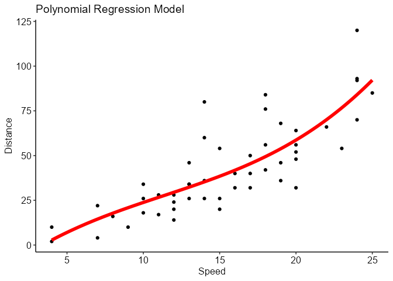

<!--more-->

## Introduction to Regression Analysis.    

Regression analysis is a powerful statistical technique used to model and analyze relationships between variables. It enables us to understand how changes in one variable are associated with changes in another variable. In the field of inferential statistics, regression analysis plays a vital role in making predictions and drawing meaningful insights from data.
     
One of the most commonly used types of regression analysis is linear regression, which assumes a linear relationship between the predictor variables and the response variable. Linear regression also has certain assumptions, including linearity, independence, normality, and homoscedasticity, which need to be assessed and satisfied for accurate interpretation of the results. We'll explore these assumptions in detail in a separate blog post.

There are other types of regression analysis, such as, logistic regression, and polynomial regression, which offer distinct approaches to modeling relationships based on the characteristics of the data. By understanding the strengths and appropriate applications of each type, we can effectively explore and analyze diverse datasets.   


## Exploring Regression Analysis with R's Built-in Datasets

Let's dive into the practical side of regression analysis using R's built-in datasets. We'll demonstrate three types of regression analysis: linear regression, logistic regression, and polynomial regression.

### ***1. Simple Linear Regression***   

Linear regression helps us examine the linear relationship between two continuous variables. We'll use the "mtcars" dataset to predict a car's fuel efficiency (mpg) based on its horsepower.    


```r
#load the dataset
data(mtcars)
#fit a simple linear regressionmodel
lm_fit <- lm(mpg ~ hp, data = mtcars)
# Interpret the results and assess the relationship
summary(lm_fit)
## 
## Call:
## lm(formula = mpg ~ hp, data = mtcars)
## 
## Residuals:
##     Min      1Q  Median      3Q     Max 
## -5.7121 -2.1122 -0.8854  1.5819  8.2360 
## 
## Coefficients:
##             Estimate Std. Error t value Pr(>|t|)    
## (Intercept) 30.09886    1.63392  18.421  < 2e-16 ***
## hp          -0.06823    0.01012  -6.742 1.79e-07 ***
## ---
## Signif. codes:  0 '***' 0.001 '**' 0.01 '*' 0.05 '.' 0.1 ' ' 1
## 
## Residual standard error: 3.863 on 30 degrees of freedom
## Multiple R-squared:  0.6024,	Adjusted R-squared:  0.5892 
## F-statistic: 45.46 on 1 and 30 DF,  p-value: 1.788e-07
```
     
From the results of the simple linear regression model, we can draw several conclusions regarding the relationship between a car's horsepower (hp) and its fuel efficiency (mpg) using the "mtcars" dataset. The coefficient estimates reveal that there is a significant negative relationship between horsepower and fuel efficiency. For every unit increase in horsepower, the fuel efficiency of a car is expected to decrease by approximately 0.06823 units. The intercept term of 30.09886 indicates the estimated fuel efficiency when the horsepower is zero. The p-value associated with the coefficient estimate of horsepower is extremely small (1.79e-07), indicating strong evidence against the null hypothesis of no relationship. Additionally, the adjusted R-squared value of 0.5892 suggests that the model explains around 58.92% of the variance in fuel efficiency.    


      
### ***2. Multiple Linear Regression***   

Multiple linear regression allows us to model the relationship between a dependent variable and multiple independent variables. We'll use the "mtcars" dataset to predict a car's fuel efficiency (mpg) based on its horsepower, weight, and number of cylinders.


```r
# Perform multiple linear regression
lm_fit <- lm(mpg ~ hp + wt + cyl, data = mtcars)
# Interpret the results and assess the relationships
summary(lm_fit)
## 
## Call:
## lm(formula = mpg ~ hp + wt + cyl, data = mtcars)
## 
## Residuals:
##     Min      1Q  Median      3Q     Max 
## -3.9290 -1.5598 -0.5311  1.1850  5.8986 
## 
## Coefficients:
##             Estimate Std. Error t value Pr(>|t|)    
## (Intercept) 38.75179    1.78686  21.687  < 2e-16 ***
## hp          -0.01804    0.01188  -1.519 0.140015    
## wt          -3.16697    0.74058  -4.276 0.000199 ***
## cyl         -0.94162    0.55092  -1.709 0.098480 .  
## ---
## Signif. codes:  0 '***' 0.001 '**' 0.01 '*' 0.05 '.' 0.1 ' ' 1
## 
## Residual standard error: 2.512 on 28 degrees of freedom
## Multiple R-squared:  0.8431,	Adjusted R-squared:  0.8263 
## F-statistic: 50.17 on 3 and 28 DF,  p-value: 2.184e-11
```

The results of the multiple linear regression model provide further insights into the relationship between car attributes and fuel efficiency in the "mtcars" dataset. The inclusion of additional variables, namely weight (wt) and number of cylinders (cyl), allows for a more comprehensive analysis. The coefficient estimates reveal that weight has a significant negative relationship with fuel efficiency, with an estimated decrease of approximately 3.16697 units in fuel efficiency for every unit increase in weight. The number of cylinders also shows a negative relationship, suggesting that more cylinders lead to lower fuel efficiency, although it is not statistically significant at the conventional significance level (p-value = 0.098480). When comparing these findings to the simple linear regression results, we can observe that the coefficient estimate for horsepower (hp) in the multiple regression model is not statistically significant (p-value = 0.140015). This indicates that the relationship between horsepower and fuel efficiency may be influenced by the inclusion of other variables (confounded). The adjusted R-squared value of 0.8263 suggests that the multiple regression model explains approximately 82.63% of the variance in fuel efficiency, indicating a better fit than the simple linear regression model.    

### ***3. Logistic Regression***


```r
#load the dataset
data(iris)
#fit a logistic regression
logit_fit <- glm(Species == "setosa" ~ Sepal.Length, 
                 data = iris, family = "binomial")
#view and interpret the results to assess the relationship
summary(logit_fit)
## 
## Call:
## glm(formula = Species == "setosa" ~ Sepal.Length, family = "binomial", 
##     data = iris)
## 
## Coefficients:
##              Estimate Std. Error z value Pr(>|z|)    
## (Intercept)   27.8285     4.8276   5.765 8.19e-09 ***
## Sepal.Length  -5.1757     0.8934  -5.793 6.90e-09 ***
## ---
## Signif. codes:  0 '***' 0.001 '**' 0.01 '*' 0.05 '.' 0.1 ' ' 1
## 
## (Dispersion parameter for binomial family taken to be 1)
## 
##     Null deviance: 190.954  on 149  degrees of freedom
## Residual deviance:  71.836  on 148  degrees of freedom
## AIC: 75.836
## 
## Number of Fisher Scoring iterations: 7
```

Based on the results of the logistic regression model, we can draw conclusions about the relationship between sepal length and the probability of the species being "setosa" in the iris dataset. The coefficient estimate for sepal length is -5.1757, indicating that there is a negative association between sepal length and the likelihood of the species being "setosa." This means that as sepal length increases, the probability of the species being "setosa" decreases. The coefficient estimate is statistically significant (p-value < 0.001), suggesting that sepal length is a significant predictor of the species classification. The intercept term has a coefficient estimate of 27.8285, representing the log-odds of the species being "setosa" when sepal length is zero. The deviance values indicate a good fit of the model to the data, with a lower residual deviance compared to the null deviance. The AIC value of 75.836 suggests that the logistic regression model provides a reasonable balance between model fit and complexity.   


### ***4. Polynomial Regression***

Polynomial regression captures nonlinear relationships by fitting a polynomial function to the data. Using the "cars" dataset, we'll explore the relationship between a car's speed and its stopping distance.   


```r
#loading the cars dataset
data(cars)
#perform polynomial regression
poly_fit <- lm(dist ~ poly(speed, degree = 3), data = cars)
# Interpret the results and assess the relationship
summary(poly_fit)
## 
## Call:
## lm(formula = dist ~ poly(speed, degree = 3), data = cars)
## 
## Residuals:
##     Min      1Q  Median      3Q     Max 
## -26.670  -9.601  -2.231   7.075  44.691 
## 
## Coefficients:
##                          Estimate Std. Error t value Pr(>|t|)    
## (Intercept)                 42.98       2.15  19.988  < 2e-16 ***
## poly(speed, degree = 3)1   145.55      15.21   9.573  1.6e-12 ***
## poly(speed, degree = 3)2    23.00      15.21   1.512    0.137    
## poly(speed, degree = 3)3    13.80      15.21   0.907    0.369    
## ---
## Signif. codes:  0 '***' 0.001 '**' 0.01 '*' 0.05 '.' 0.1 ' ' 1
## 
## Residual standard error: 15.2 on 46 degrees of freedom
## Multiple R-squared:  0.6732,	Adjusted R-squared:  0.6519 
## F-statistic: 31.58 on 3 and 46 DF,  p-value: 3.074e-11
```
      
Based on the results of the polynomial regression model, we can draw conclusions about the relationship between speed and stopping distance in the cars dataset. The model incorporates a cubic polynomial term for speed to capture potential nonlinearities in the relationship. The coefficient estimates indicate that the intercept is 42.98, representing the estimated stopping distance when speed is zero. The coefficient estimates for the polynomial terms suggest that the relationship between speed and stopping distance is best approximated by the linear term (degree 1), which has a coefficient estimate of 145.55 and is statistically significant (p-value < 0.001). The quadratic term (degree 2) and cubic term (degree 3) do not appear to have significant associations with stopping distance. The multiple R-squared value of 0.6732 indicates that the model explains approximately 67.32% of the variance in stopping distance. The adjusted R-squared value of 0.6519 suggests that the model's goodness of fit is slightly penalized for including additional terms. The F-statistic is significant (p-value < 0.001), indicating that the overall model is statistically significant. In conclusion, the polynomial regression model suggests a significant linear relationship between speed and stopping distance, while the quadratic and cubic terms do not contribute significantly to the model.    




## Real-world Applications of regression analysis.   

In conclusion, regression analysis is a powerful statistical technique that allows us to model and analyze relationships between variables. Throughout this blog post, we have explored various types of regression analysis and how they could be applied in real-world scenarios.

This post is a continuation of the concept of inferential statistics as met in my earlier posts about [hypothesis testing](https://tipsydata.netlify.app/post/2023-05-28-statistical-data-analysis-in-r/) and [confidence intervals](https://tipsydata.netlify.app/post/2023-05-29-inferential-statistics-confidence-intervals-in-r/), this time round about regression analysis, highlighting their importance in understanding and predicting relationships between variables. Regression analysis enables us to examine the impact of one or more predictor variables on a response variable, providing insights into the underlying patterns and trends in the data.

We then delved into different types of regression analysis, including simple linear regression, multiple linear regression, logistic regression, and polynomial regression. Each type offers unique insights into specific scenarios and can be applied to diverse fields such as economics, social sciences, healthcare, and more.

By using built-in datasets in R and providing code examples, we showcased how regression analysis can be implemented and interpreted. We explored the coefficients, standard errors, t-values, p-values, and significance codes, all of which play crucial roles in understanding the relationship between variables and the strength of the statistical evidence.

Moreover, we discussed the assumptions of linear regression models, emphasizing the need for fulfilling these assumptions to ensure reliable and valid results. Additionally, we highlighted the importance of model evaluation, such as examining the residual standard error, R-squared, and adjusted R-squared values, as well as conducting hypothesis tests and assessing the overall model fit.

In summary, regression analysis is a versatile statistical tool that enables us to uncover relationships between variables and make predictions in real-world applications. By understanding the concepts, implementing the appropriate models, and interpreting the results correctly, we can gain valuable insights and make informed decisions based on data-driven evidence. So, whether it's predicting sales, understanding customer behavior, or analyzing the impact of interventions, regression analysis provides a powerful framework for extracting meaningful information from data.

Happy Regression analysis in R!

Please leave a comment about the content from this post.
