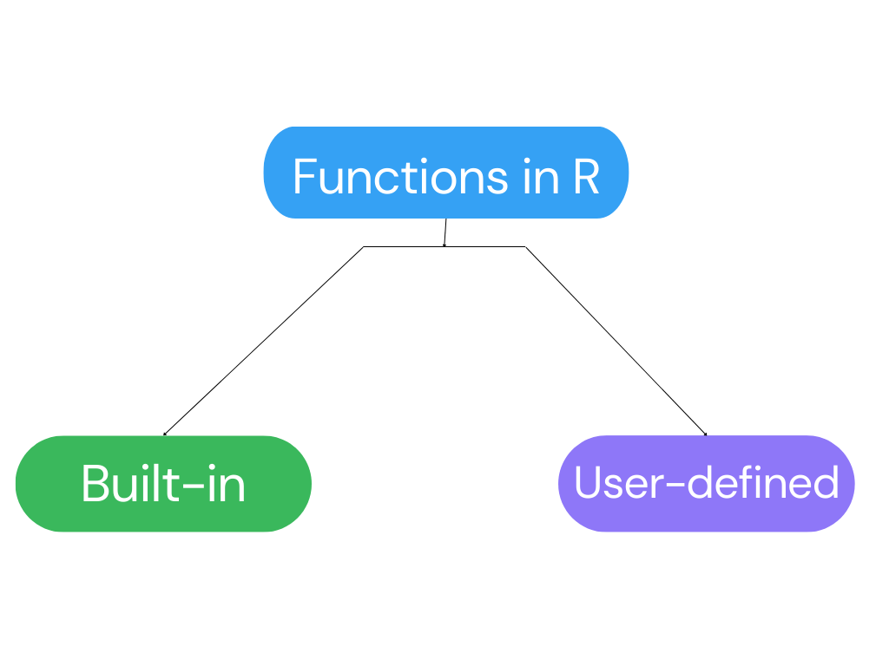

```{r setup, include=FALSE}
knitr::opts_chunk$set(collapse = TRUE, fig.show = 'all')
```

<!--more-->

## Introduction to functions in R.    



Functions are the lifeblood of programming in R. They enable us to streamline our code, optimize efficiency, and reuse solutions across different scenarios. In this blog post, we'll dive into the fascinating application of functions in R, exploring why they are essential, how to create and use them, when to apply them, and where they can make a significant impact on your data analysis projects.

R offers a rich collection of built-in functions that cover a wide range of data manipulation, analysis, and visualization tasks. These functions provide powerful tools for handling data structures, performing statistical calculations, and creating visual representations. 

In addition to the built-in functions, R allows you to create your own custom functions. User-defined functions empower you to tailor the code to your specific needs and extend R's functionality beyond what is provided by default. This opens up endless possibilities for creating specialized functions that address unique requirements or solve complex problems in your domain of interest.

### Components of a function in R.   

A function in R consists of several components that work together to define its behavior. These components include the function name, the input parameters, the function body, and the output. The function name is the identifier used to call the function. The input parameters are variables that act as placeholders for the values passed into the function. The function body contains the instructions or calculations that define the function's logic. Finally, the output is the value or values returned by the function. 

Below is an example of a function in R, with the components described in the comments;  

```{r}
#example of a simple function: Calculate the square root of a given number
#function's name: square_root
#input: num (a numeric value)
#output: The square root of "num"

square_root<- function(num) {
  
  #function's body/ arguments
  root <- sqrt(num)
  return(root)  # output
}
#calling a function
square_root(9)
```


## Functions are useful to:  

### *Simplify Your Code.*    

Functions allow us to break down complex tasks into smaller, manageable chunks. By encapsulating a series of instructions within a function, we can create modular code that is easier to read, understand, and maintain. For example, consider a task that involves calculating the average value of all the numerical variable from the `mtcars` dataset. With a function, we can encapsulate the calculations in a single reusable entity, enhancing code simplicity and readability.

```{r}
data(mtcars)
#define a function to calculate the average value of only the numerical variables
calculate_average <- function(data) {
  numeric_vars <- sapply(data, is.numeric)
  avg_values <- sapply(data[, numeric_vars], mean)
  return(avg_values)}
#call the function on the mtcars dataset
average_values <- calculate_average(mtcars)
#print the average values
print(average_values)
```

     
### *Optimize Efficiency.*    

Functions in R allow us to optimize code efficiency by avoiding redundant computations. Instead of writing the same set of instructions repeatedly, we can encapsulate them within a function and call it whenever needed. This approach minimizes code duplication and reduces the chances of errors. It also improves code maintenance and makes it easier to update and modify specific functionality without affecting the entire codebase.

***$\color{red}{\text{DON'T DO THIS}}$***

```{r}
#repetitive code to calculate the square of a number
num1 <- 2
square_num1 <- num1 * num1
print(square_num1)
num2 <- 5
square_num2 <- num2 * num2
print(square_num2)
num3 <- 8
square_num3 <- num3 * num3
print(square_num3)


# ... and so on for more numbers
```

***$\color{green}{\text{DO THIS INSTEAD}}$***    

```{r}
#create a function to calculate the square of a number
calculate_square <- function(num) {
  return(num * num)
}
# Call the function for different numbers
num1 <- 2
square_num1 <- calculate_square(num1)
print(square_num1)
num2 <- 5
square_num2 <- calculate_square(num2)
print(square_num2)
num3 <- 8
square_num3 <- calculate_square(num3)
print(square_num3)


# ... and so on for more numbers
```

In the poorly written, repeated code example, the instructions to calculate the square of a number are repeated multiple times. This not only leads to code duplication but also increases the chances of errors if any changes need to be made to the calculations. The code becomes harder to maintain and update as the number of repetitions increases.

In contrast, the functional programming approach uses a function called `calculate_square()` to encapsulate the square calculation logic. By calling this function with different numbers, we can compute the squares efficiently without repeating the same code. This approach improves code maintainability, reduces the chances of errors, and makes it easier to modify or update the square calculation logic if needed.

### *Reuse Solutions.*    

One of the greatest advantages of functions is their reusability. Once you've created a function to solve a specific problem, you can reuse it across different projects or within the same project with different datasets. This saves time and effort by eliminating the need to rewrite the same code repeatedly. It also ensures consistency and accuracy in your analyses, as you can rely on a well-tested and reliable function.

```{r}
#function to calculate the sum of a vector
calculate_sum <- function(x) {
  return(sum(x))}
#reusing the `calculate_sum` function with different datasets
vector1 <- c(1, 2, 3, 4, 5)
sum_dataset1 <- calculate_sum(vector1)
print(sum_dataset1)
vector2 <- c(10, 20, 30)
sum_dataset2 <- calculate_sum(vector2)
print(sum_dataset2)
```


### *Function with Parameters.*   

Functions can accept parameters, allowing you to customize their behavior based on specific inputs. These parameters act as placeholders for values that are passed into the function when it is called. By leveraging parameters, you can create versatile functions that adapt to different scenarios without the need for hardcoding values. This flexibility enhances code reusability and promotes a more dynamic and adaptable workflow.    

```{r}
#code to calculate summary statistics for a specific variable
calculate_summary <- function(data, variable) {
  summary <- summary(data[,variable])
  return(summary)}
#call the function with different parameters
summary_mpg <- calculate_summary(mtcars, "mpg")
print(summary_mpg)
summary_hp <- calculate_summary(mtcars, "hp")
print(summary_hp)
data(iris)
summary_sepaL <- calculate_summary(iris, "Sepal.Length")
print(summary_sepaL)
summary_sepaW<- calculate_summary(iris, "Sepal.Width")
print(summary_sepaW)
```
     
## Conclusion.    

In conclusion, functions are a fundamental aspect of programming in R, offering numerous benefits that enhance code simplicity, efficiency, reusability, and flexibility. They enable us to break down complex tasks into manageable chunks, making our code easier to read, understand, and maintain. With functions, we can optimize code efficiency by avoiding redundant computations, reducing code duplication, and improving overall code maintenance. We can also reuse well-tested functions across different projects or datasets, saving time and ensuring consistent and accurate analyses. Additionally, functions with parameters allow us to customize their behavior based on specific inputs, promoting a more dynamic and adaptable workflow.

Using the power of functions in R, we can streamline our data analysis projects, tackle complex problems, and unlock new insights from our data. Needless to say, the use of functions is regarded as a best practice not just in R but across all other programming languages.

Cheers to your unlocking the power of functions in R! 🎉


