```{r setup, include=FALSE}
knitr::opts_chunk$set(collapse = TRUE, fig.show = 'all', options(scipen = 999))
```

<!--more-->

## Introduction.      

Statistical distributions play a crucial role in data analysis and modeling. Understanding their characteristics, generating data from them, and visualizing their properties are essential skills for any data scientist or analyst. In this comprehensive guide, we will explore various statistical distributions in R, including the normal, exponential, binomial, Poisson, gamma, Bernoulli, uniform, beta, and multivariate normal distributions. Additionally, we will explore their interrelationships and discuss the Central Limit Theorem (CLT) and its significance in statistical analysis.

### 1. The Normal Distribution.

The normal distribution \(\mathcal{N}(\mu, \sigma^2)\), also known as the Gaussian distribution, is a widely used continuous probability distribution. It is symmetric, bell-shaped, and characterized by its mean and standard deviation. In R, we can easily generate data from a normal distribution using the `rnorm()` function. By specifying the desired sample size, mean, and standard deviation, we can create datasets that follow the normal distribution. In the code example below, we generate data from a standard normal distribution (mean = 0, standard deviation = 1) (\(\mathcal{N}(0, 1)\)) with different sample sizes. We then compute summary statistics, such as the mean and standard deviation, to gain insights into the characteristics of the data. Finally, we visualize the distributions using density plots, allowing us to observe the shape and density of the data.

```{r normal}
#set the random number generator seed for reproducible results
set.seed(111)
#create a 2 by 2 grid of plots
par(mar=c(2,2,2,2), mfrow = c(2, 2))
#generate data from the standard normal distribution with different sample sizes
sample_sizes <- c(100, 1000, 10000, 100000)
for (size in sample_sizes) {
  data <- rnorm(size, mean = 0, sd = 1)
  #create a density plot for each sample size
  plot(density(data), col = "blue", 
       main = paste("Normal Distribution (n =", size, ")"))
  # Calculate summary statistics
  mean_data <- mean(data)
  sd_data <- sd(data)
  cat("Summary Statistics (n =", size, "):\n")
  cat("Mean:", mean_data, "\n")
  cat("Standard Deviation:", sd_data, "\n\n")}
# Reset the plotting layout to default
par(mfrow = c(1, 1))

```

      
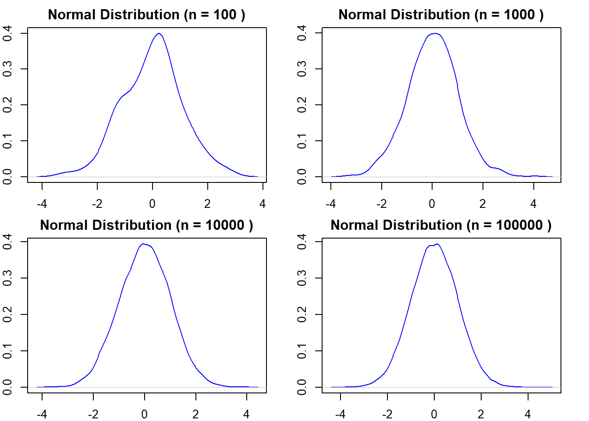

     
The observed statistics from the summary statistics of the sample sizes demonstrate the central tendency of the data, represented by the mean, and the dispersion of the data points around the mean, represented by the standard deviation. As the sample size increases, the sample means tend to approach the population mean (0 in this case), and the spread of data becomes narrower, indicating a higher level of precision in estimating the population parameters.   


### 2. The Uniform Distribution.    

The uniform distribution represents a continuous random variable with equal probability over a specified interval.  

The probability density function (PDF) of the Uniform distribution is given by:

\[f(x) = \frac{1}{b - a}\]

where \(a\) and \(b\) are the minimum and maximum values of the distribution, respectively.


```{r uniform}
rm(list=ls())#clear the workspace(incase we reuse variable names)
#generate data from a uniform distribution
set.seed(111)
minu <- 0
maxu <- 1
sizes <- c(100, 1000, 10000, 100000)
par(mar=c(2,2,2,2),mfrow=c(2,2))
for (i in 1:length(sizes)) {
  size <- sizes[i]
    #generate data from the binomial distribution
  datau <- runif(size, minu, maxu)
  #create a bar chart
  plot(density(datau), main = paste("Uniform dist. (Size =", size, ")"),
       col = "red")}
```
      
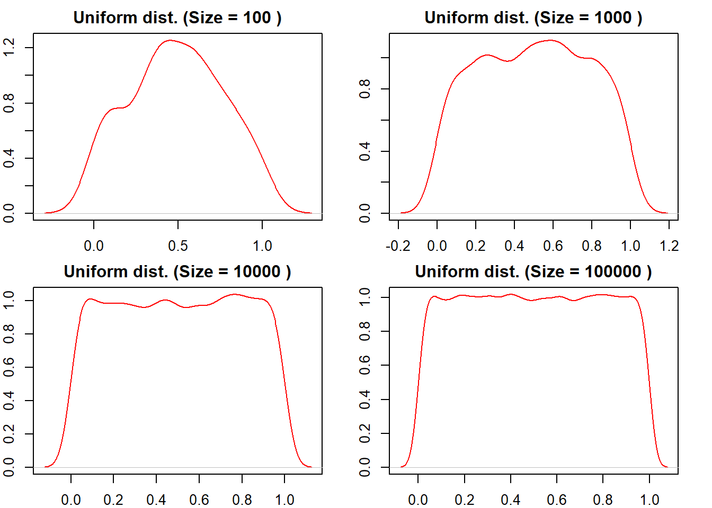

      
The uniform distribution is evenly distributed within the specified interval, and these density plots demonstrate how the density becomes more uniform and stable as the sample size increases. Understanding the characteristics of the uniform distribution and how it behaves with different sample sizes is valuable when working with data that follows this distribution, such as random number generation or certain simulation scenarios


### 3. The Exponential Distribution.    

The exponential distribution ($X \sim \text{Exponential}(\lambda)$) models the time between events in a Poisson process, where events occur continuously and independently at a constant average rate (also known as decay rate). In the code example below, we generate three sets of data from an exponential distribution in R, each with a different decay rate. Here we use the `rexp()` function, and visualize the resulting density distributions as below;

```{r exponential}
rm(list=ls())
#generate data from exponential distributions with different rates of decay
set.seed(111)
data_rate_0.5 <- rexp(10000, rate = 0.5)
data_rate_0.375 <- rexp(10000, rate = 0.375)
data_rate_0.25 <- rexp(10000, rate = 0.25)
#create a plot with density lines
#resize plotting window
par(mar=c(2,2,2,2))
plot(density(data_rate_0.5), col = "blue", lwd = 2, main = "Exponential Distribution", xlab = "Values", ylab = "Density")
lines(density(data_rate_0.375), col = "green", lwd = 2)
lines(density(data_rate_0.25), col = "red", lwd = 2)
legend("topright", legend = c("Rate 0.5", "Rate 0.375", "Rate 0.25"), col = c("blue", "green", "red"), lwd = 2)
```
     
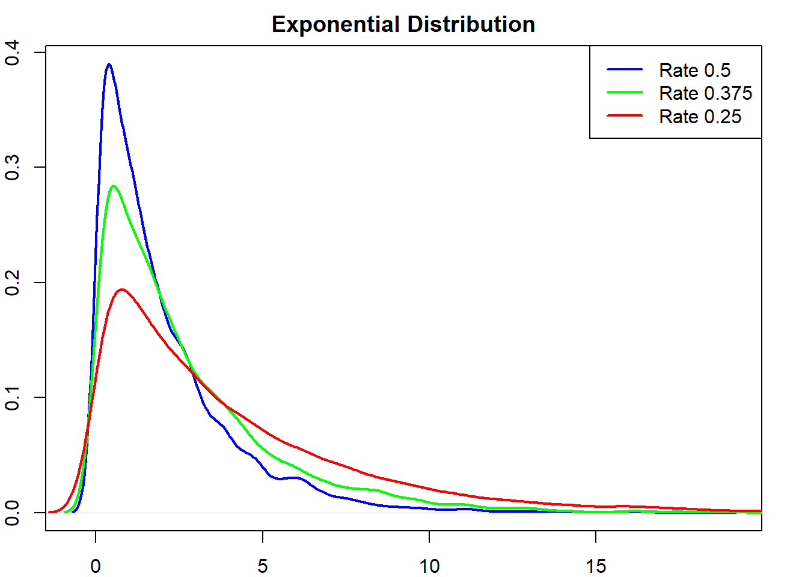
     
From the plot, we observe that as the rate of decay increases, the density curve becomes steeper and more concentrated around zero. This means that distributions with higher rates of decay have a higher likelihood of producing smaller values. Conversely, distributions with lower rates of decay have a more spread-out density curve, indicating a higher likelihood of producing larger values.    


### 4. The Bernoulli Distribution.    

The Bernoulli distribution models a binary random variable, typically representing the success or failure of a single trial with a fixed probability.

The probability mass function (PMF) of the Bernoulli distribution is given by:

\[
f(x; p) = p^x \cdot (1 - p)^{1 - x}
\]

where \(x\) is the outcome (0 or 1) and \(p\) is the probability of success.


```{r bernoulli}
rm(list=ls())
#generate data from a Bernoulli distribution
set.seed(111)
data <- rbinom(1000, size = 1, prob = 0.6)
#create a bar plot
barplot(table(data), col = "orange", 
        main = "Bernoulli Distribution")
```
     
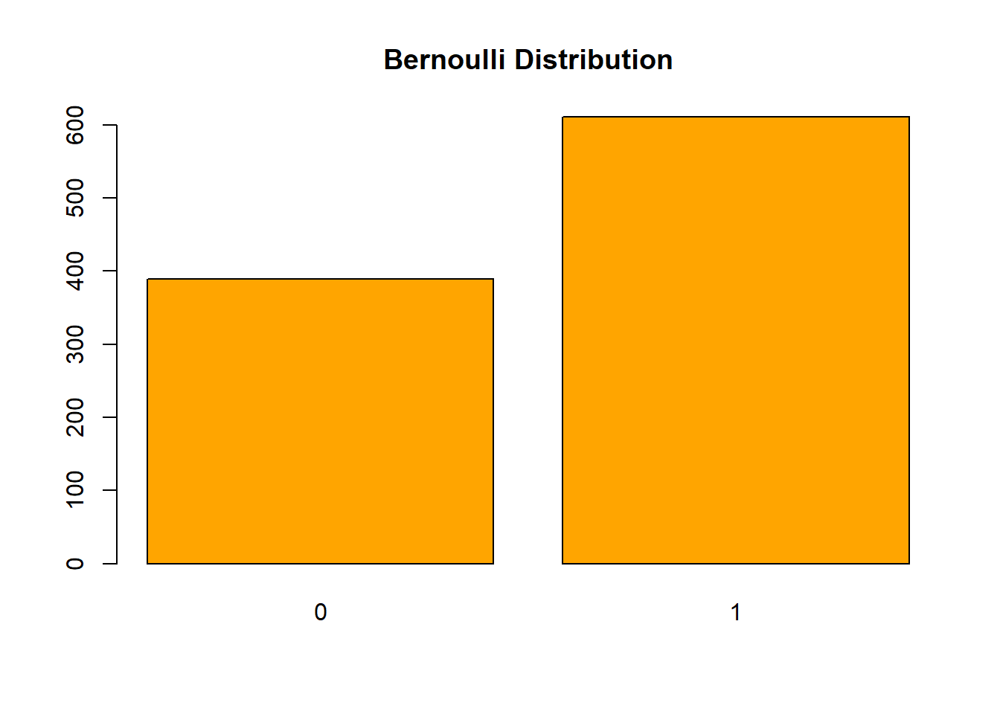


      
In the bar plot, we can observe two bars representing the two possible outcomes: success and failure. The height of each bar represents the frequency of occurrence for that particular outcome. In this specific example, the probability of success is set to 0.6, indicating that the success outcome occurs more frequently.    

Understanding the Bernoulli distribution is essential when working with binary data or situations that involve a single trial with a fixed probability. The bar plot effectively showcases the distribution and provides valuable insights into the probability of success in the given scenario.


      
### 5. The Binomial Distribution.   

The binomial distribution ($X \sim \text{Binomial}(n,p)$) models the number of successes in a fixed number of independent Bernoulli trials. It is characterized by two parameters:   

- the number of trials and,
- the probability of success.    

In our code example below, we are going to fix the number of trials as well as the probability of success. Next we shall generate data based on varying number observations, for us to easily compare the results through visualization.   


```{r binomial}
rm(list=ls())
#set the seed for reproducible results
set.seed(111)
#define the fixed parameters
n <- 10          #number of trials (fixed)
p <- 0.5         #probability of success (fixed)
sizes <- c(1,5,25,125,625,3125,15625,78125,390625)#different number of observations
#create a 3x3 grid for the plots
par(mar=c(2,2,2,2), mfrow = c(3, 3))
#loop over the different sizes
for (i in 1:length(sizes)) {
  size <- sizes[i]
    #generate data from the binomial distribution
  data <- rbinom(size, n, p)
    #create a bar chart
  barplot(table(data), main = paste("Binomial dist. (Size =", size, ")"),
          xlab = "Number of Successes", 
          ylab = "Frequency", col = "cornflowerblue")}

```
     
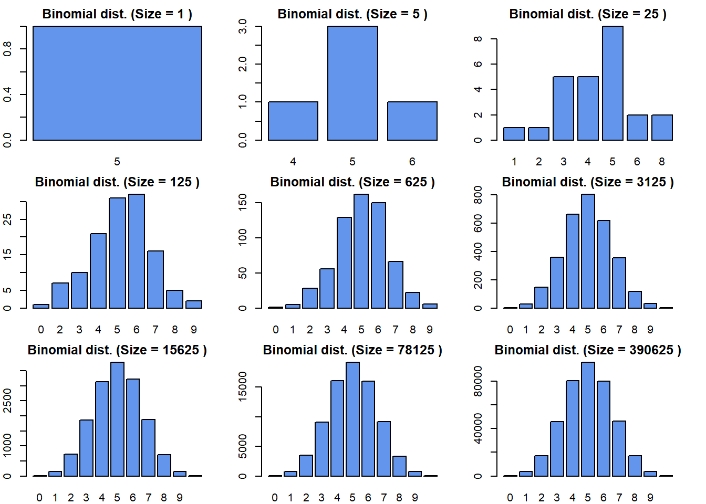

       

As the number of observations increases in the binomial distribution with a fixed number of trials (10) and a fixed probability of success (0.5), we observe a central tendency in the distribution. The distribution becomes more symmetric around its mean, indicating a balanced distribution of successes and failures. The mean represents the expected number of successes, which remains constant at 5 for this fixed probability. With a larger number of observations, the distribution becomes more concentrated around the mean, resulting in a narrower spread of possible outcomes.    


### 6. The Poisson Distribution.    

The Poisson distribution: ($$P(X = k) = \frac{{e^{-\lambda} \cdot \lambda^k}}{{k!}}$$)

models the number of events occurring in a fixed interval of time or space, given a constant average rate. In the following code example, we explore the Poisson distribution with different lambda values. The lambda parameter represents the average rate or intensity of events.   

```{r poisson}
rm(list=ls())
#set the seed for reproducible results
set.seed(111)
# Define the lambda values
lambdas <- c(1, 2, 3, 4, 5, 6, 7, 8, 9)
#create a 3x3 grid for the plots
par(mar=c(2,2,2,2), mfrow = c(3, 3))
# Loop over different lambda values
for (i in 1:length(lambdas)) {
  lambda <- lambdas[i]
  # Generate data from the Poisson distribution
  data <- rpois(1000, lambda = lambda)
  # Create a density plot
  plot(density(data), col = "orange", 
          main = paste("Poisson dist. (Lambda =", lambda, ")"),
          xlab = "Values", ylab = "Density")
}

```
      
      
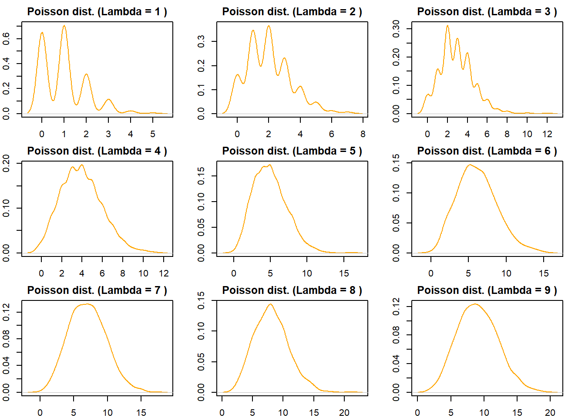
      
The density plots above show the probability density of observing different values, allowing us to compare the shapes and central tendencies of the distributions. This implies that increasing the lambda rate $(\lambda)$ in the Poisson distribution leads to a more concentrated, right-skewed distribution that becomes increasingly symmetric, with higher probabilities for larger values and larger variance.    


### 7. The Gamma Distribution.   

The gamma distribution; \[f(x; \alpha, \beta) = \frac{{\beta^\alpha}}{{\Gamma(\alpha)}} \cdot x^{\alpha-1} \cdot e^{-\beta x}\]

where:   
- $x$ represents the random variable,
- $\alpha$ is the shape parameter,
- $\beta$is the rate parameter,
- $\Gamma(\alpha)$ is the gamma function,

is a continuous probability distribution that generalizes both the exponential and chi-squared distributions. It is characterized by its shape and scale parameters.

```{r gamma}
rm(list=ls())
#set the seed for reproducible results
set.seed(111)
data_1 <- rgamma(1000, shape = 1, rate = 2)
data_2 <- rgamma(1000, shape = 2, rate = 2)
data_3 <- rgamma(1000, shape = 2, rate = 3)
data_4 <- rgamma(1000, shape = 3, rate = 2)
#create density plots
plot(density(data_1), col = "red", main = "Gamma distributions")
lines(density(data_2), col="green")
lines(density(data_3), col="blue")
lines(density(data_4), col="black")
legend("topright", legend = c("shape 1 & Rate 2",
                              "shape 2 & Rate 2",
                              "shape 2 & Rate 3",
                              "shape 3 & Rate 2"), 
       col = c("red", "green","blue","black" ), lwd = 2)
```
     
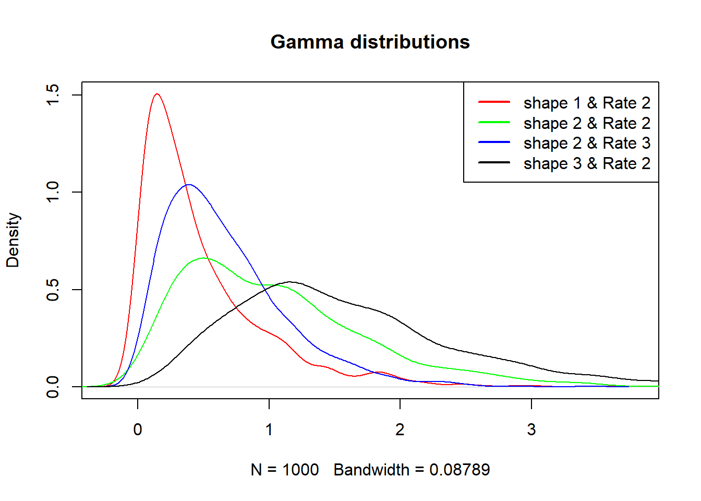


      
The four Gamma distributions plotted above demonstrate how different combinations of shape and rate parameters influence the shape, skewness, and spread of the distribution. As the shape parameter increases, the distribution becomes more symmetric, while the rate parameter affects the concentration of values around the mean. 
These insights can be valuable for understanding and analyzing data that follows a Gamma distribution, such as certain types of waiting times or duration data.

### 8. The Beta Distribution.    

The beta distribution is a continuous probability distribution defined on the interval [0, 1]. It is commonly used to model proportions or probabilities.  

The distribution is usually expressed as;  

\[ f(x|\alpha, \beta) = \frac{1}{B(\alpha, \beta)} \cdot x^{\alpha-1} \cdot (1-x)^{\beta-1} \]

Where:
- \( x \) is the random variable, with \( 0 \leq x \leq 1 \)
- \( \alpha \) and \( \beta \) are the shape parameters of the Beta distribution
- \( B(\alpha, \beta) \) is the Beta function, defined as \( B(\alpha, \beta) = \frac{\Gamma(\alpha) \cdot \Gamma(\beta)}{\Gamma(\alpha + \beta)} \), where \( \Gamma() \) denotes the gamma function.


```{r beta}
rm(list=ls())
#set the seed for reproducible results
set.seed(111)
data_1 <- rbeta(1000, shape1 = 1, shape2 = 2)
data_2 <- rbeta(1000, shape1 = 2, shape2 = 2)
data_3 <- rbeta(1000, shape1 = 2, shape2 = 3)
data_4 <- rbeta(1000, shape1 = 3, shape2 = 2)
data_5 <- rbeta(1000, shape1 = 1, shape2 = 1)
#create density plots
plot(density(data_1), col = "red", main = "Beta distributions")
lines(density(data_2), col="green")
lines(density(data_3), col="blue")
lines(density(data_4), col="black")
lines(density(data_5), col="purple")
legend("topright", legend = c("shape1= 1 & shape2= 2",
                              "shape1= 2 & shape2= 2",
                              "shape1= 2 & shape2= 3",
                              "shape1= 3 & shape2= 2",
                              "shape1= 1 & shape2= 1"), 
       col = c("red", "green","blue","black", "purple"), 
       cex = 0.7, lwd = 2)
```
     
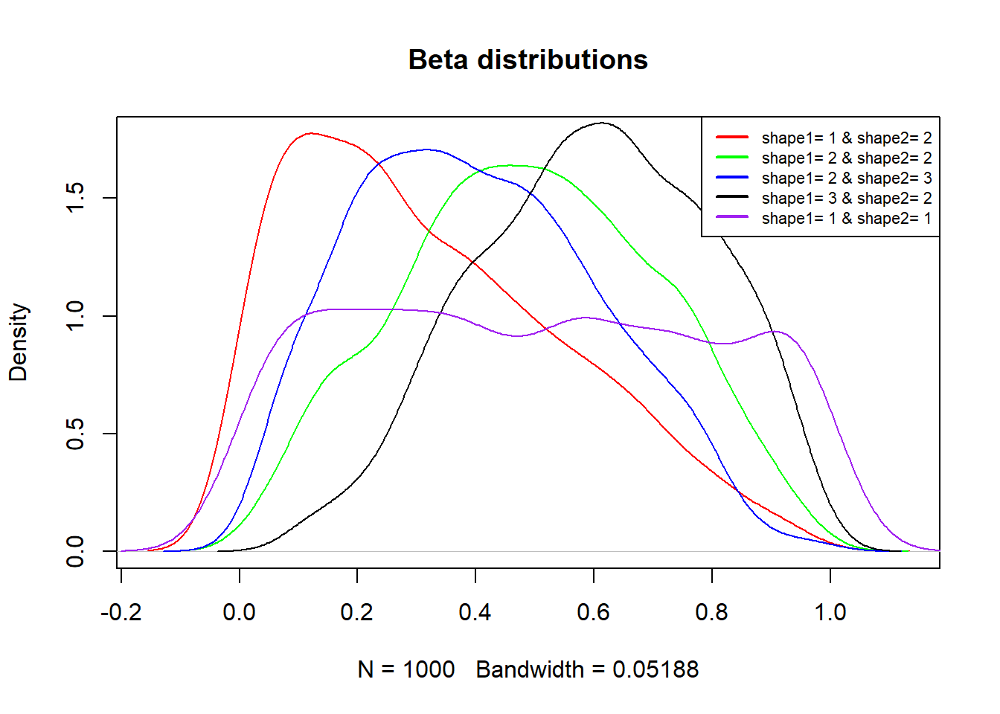


     
The density plots above effectively display the characteristics and variations of the Beta distributions with different shape parameters. When both the shape parameters are set equal to one, the beta distribution assumes the uniform distribution. This visualization allows for a better understanding of how the shape parameters impact the distribution's shape.     


### 9. The Weibull distribution.   

The Weibull distribution is a versatile and widely used probability distribution that can model a variety of phenomena in different fields, including reliability analysis, survival analysis, and extreme value analysis.   
The formula of the distribution is as follows; 
$$f(x; \text{{shape}}, \text{{scale}}) = \left(\frac{{\text{{shape}}}}{{\text{{scale}}}}\right) \cdot \left(\frac{{x}}{{\text{{scale}}}}\right)^{\text{{shape}} - 1} \cdot \exp\left(-\left(\frac{{x}}{{\text{{scale}}}}\right)^{\text{{shape}}}\right)$$   

- $x$ is the random variable,
- $shape$ is the shape parameter of the distribution, and
- $scale$ is the scale parameter of the distribution


```{r weibull}
rm(list=ls())
#set the seed for reproducible results
set.seed(111)
data_1 <- rweibull(1000, shape = 1, scale = 2)
data_2 <- rweibull(1000, shape = 2, scale = 3)
data_3 <- rweibull(1000, shape = 3, scale = 4)
#create density plots
plot(density(data_1), col = "red", main = "Weibull distributions")
lines(density(data_2), col="green")
lines(density(data_3), col="blue")
legend("topright", legend = c("shape= 1 & scale= 2",
                              "shape= 2 & scale= 3",
                              "shape= 3 & scale= 4"), 
       col = c("red", "green","blue"), lwd = 2)
```
      
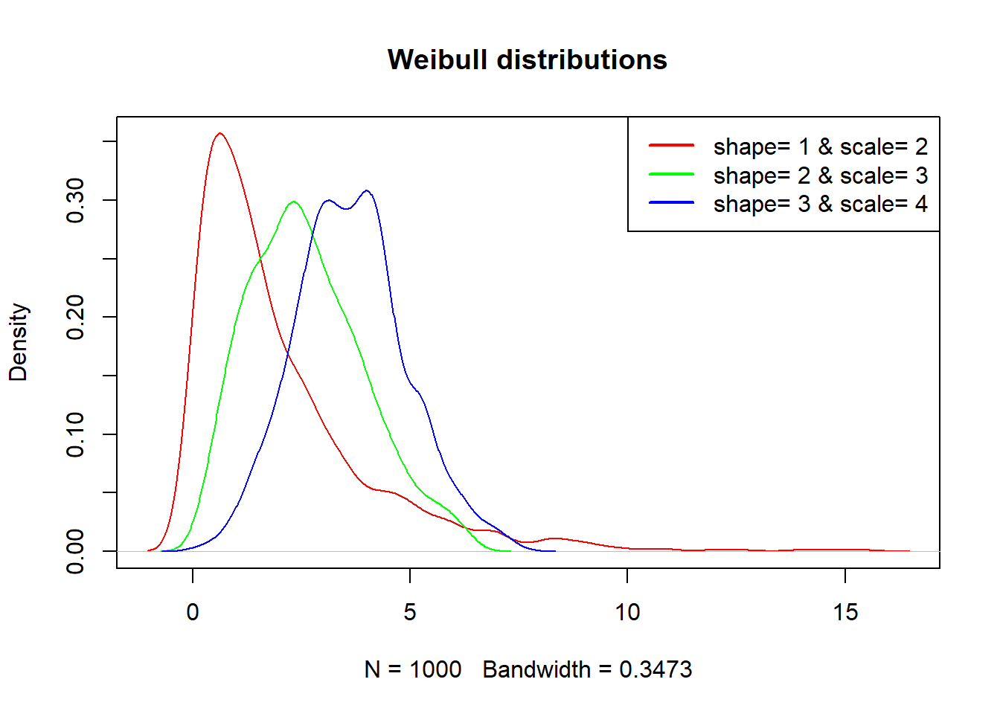

     
In the above density plots, we have generated three sets of data from Weibull distributions with varying shape and scale parameters.  


### 10. The Multivariate Distribution.   

The multivariate normal distribution generalizes the normal distribution to multiple dimensions. It is characterized by its mean vector and covariance matrix.
Its formula is written as below;  

\[ f(\mathbf{x}|\boldsymbol{\mu},\boldsymbol{\Sigma}) = \frac{1}{{(2\pi)^{d/2}|\boldsymbol{\Sigma}|^{1/2}}} \exp\left(-\frac{1}{2}(\mathbf{x}-\boldsymbol{\mu})^T \boldsymbol{\Sigma}^{-1} (\mathbf{x}-\boldsymbol{\mu})\right) \]

Where:

- $x$ represents the vector of random variables (d-dimensional),
- $\mu$ represents the mean vector (d-dimensional), and
- $\Sigma$ represents the covariance matrix (d x d)

In R, we can generate data from a multivariate normal distribution with two variables using the `mvrnorm()` function from the `MASS` package. Next, we shall create a scatter plot, and calculate summary statistics;   

```{r multivariatenorm}
rm(list=ls())
#generate data from a multivariate normal distribution
set.seed(111)
library(MASS)
mean_vec <- c(0, 0)
cov_mat <- matrix(c(1, 0.5, 0.5, 1), nrow = 2, ncol = 2)
data <- mvrnorm(1000, mu = mean_vec, Sigma = cov_mat)

par(mar=c(2,2,2,2), mfrow=c(1,2))
#create a scatter plot
scatter.smooth(data[, 1], data[, 2], col = "brown", 
               xlab = "variable 1",
               ylab = "variable 2",
               main = "Multivariate Normal Distribution")
plot(density(data[, 1]), col= "limegreen", 
     main = "Multivariate Normal Distribution")
lines(density(data[, 2]), col= "yellow")
legend("topright", legend = c("variable 1",
                              "variable 2"), 
       col = c("limegreen","yellow"), cex = 0.8,lwd = 2)

```
      
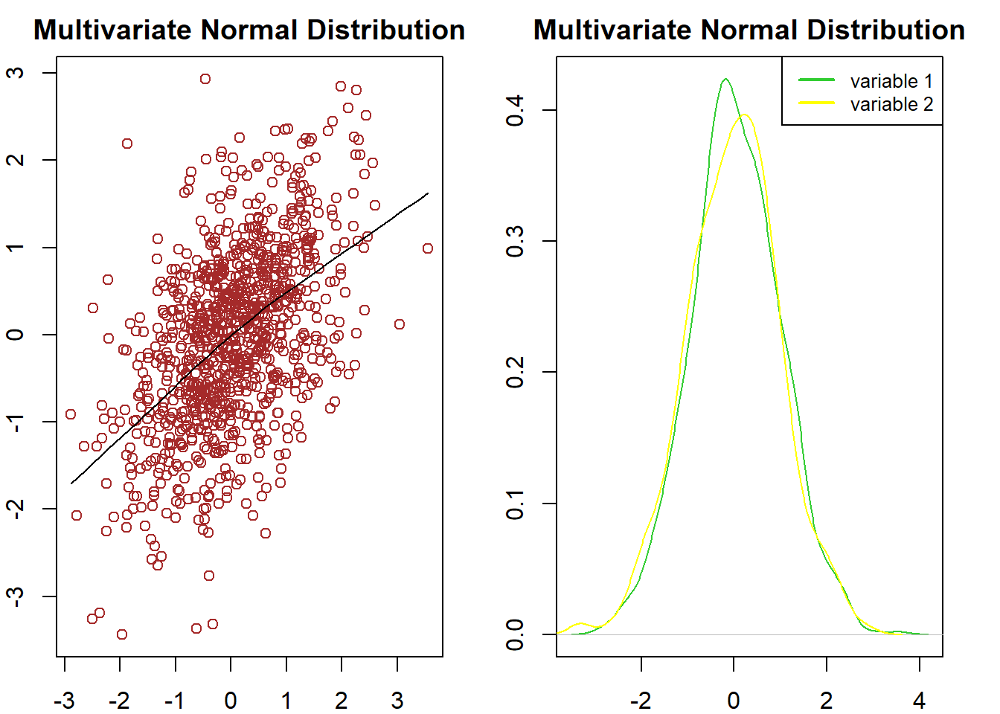
      
      
     
## The Central Limit Theorem (CLT).    

The Central Limit Theorem states that, regardless of the shape of the population distribution, the sampling distribution of the sample means will approximate a normal distribution as the sample size increases.   

```{r clt}
rm(list=ls())
set.seed(123)
normal_means <- replicate(10000, mean(rnorm(1000, mean = 0, sd = 1)))
uniform_means <- replicate(10000, mean(runif(1000, min = 0, max = 1)))
exponent_means <- replicate(10000, mean(rexp(1000, rate = 0.5)))
bernoulli_means <- replicate(10000,mean(rbinom(1000, size = 1, prob = 0.6)))
binomial_means <- replicate(10000, mean (rbinom(1000, 1, 0.5)))
poisson_means <- replicate(10000, mean(data <- rpois(1000, lambda = 1)))
gamma_means <- replicate(10000, mean(rgamma(1000, shape = 1, rate = 2)))
beta_means <- replicate(10000, mean(rbeta(1000, shape1 = 1, shape2 = 2)))
weibull_means <- replicate(10000, mean(rweibull(1000, shape = 1, scale = 2)))
par(mar=c(2,2,2,2), mfrow=c(3,3))
#plot a histogram of the sample means
hist(normal_means, breaks = 30, col = "purple", main = "Normal sample means")
hist(uniform_means, breaks = 30, col = "purple", main = "Uniform sample means")
hist(exponent_means, breaks = 30, col = "purple", 
     main = "Exponential sample means")
hist(bernoulli_means, breaks = 30, col = "purple", 
     main = "Bernoulli sample means")
hist(binomial_means, breaks = 30, col = "purple", main = "Binomial sample means")
hist(poisson_means, breaks = 30, col = "purple", main = "Poisson sample means")
hist(gamma_means, breaks = 30, col = "purple", main = "Gamma sample means")
hist(beta_means, breaks = 30, col = "purple", main = "Beta sample means")
hist(weibull_means, breaks = 30, col = "purple", main = "Weibull sample means")
```
     
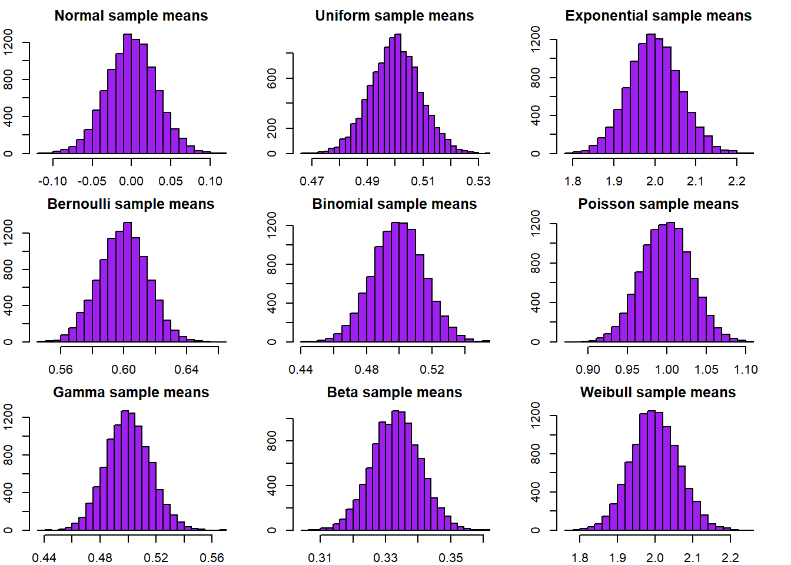
     
The Central Limit Theorem (CLT) is a fundamental concept in statistics.
It states that the sampling distribution of sample means approximates a normal distribution as sample size increases.
In the provided code example above, sample means from various distributions were generated and plotted.
Remarkably, regardless of the underlying distribution, all the histograms of sample means resemble a normal distribution.
This demonstrates the practical significance of the CLT in statistical inference.
It allows reliable estimations of population parameters and construction of confidence intervals.
The CLT is a powerful tool for making robust statistical inferences based on sample data, even when the population distribution is unknown or non-normal.


### Summary of interrelationships between statistical distributions.   

- The normal distribution can be approximated by the sum of a large number of independent and identically distributed random variables, as stated by the Central Limit Theorem.
- The exponential distribution is a special case of the gamma distribution when the shape parameter is equal to 1.
- The Poisson distribution can be approximated by the binomial distribution when the number of trials is large and the probability of success is small.
- The uniform distribution is a special case of the beta distribution when both shape parameters are set to 1.
- The normal distribution is a special case of the multivariate normal distribution when the variables are independent and identically distributed.   

## Conclusion.    

In this article, we explored various statistical distributions in R, including the normal, exponential, binomial, Poisson, gamma, Bernoulli, uniform, beta, and multivariate normal distributions. We generated data, and created plots to visualize each distribution. Additionally, we discussed the interrelationships between these distributions and emphasized the significance of the Central Limit Theorem in statistical analysis. By understanding these distributions and their properties, we can effectively model and analyze a wide range of real-world phenomena.


